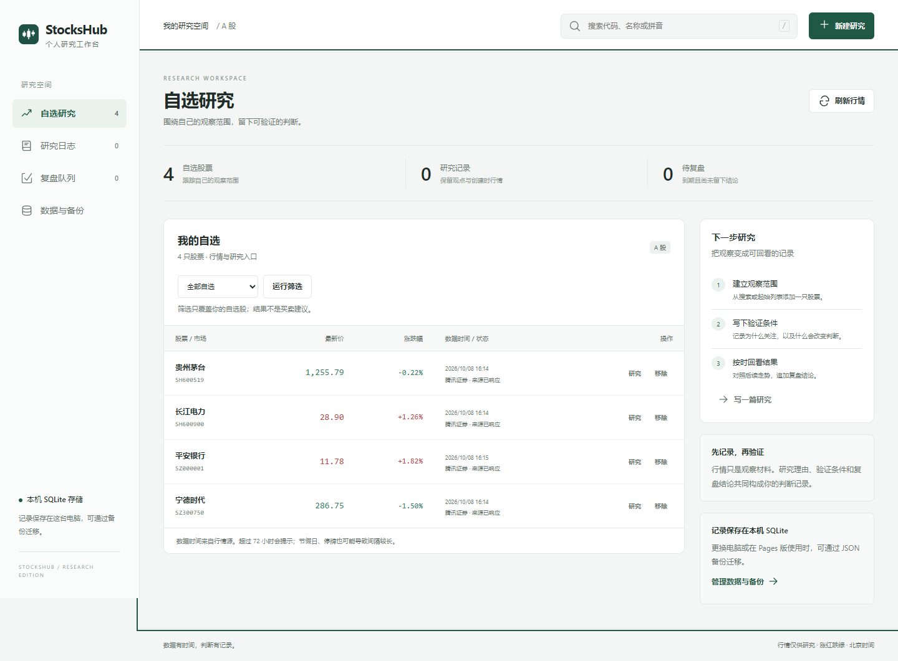
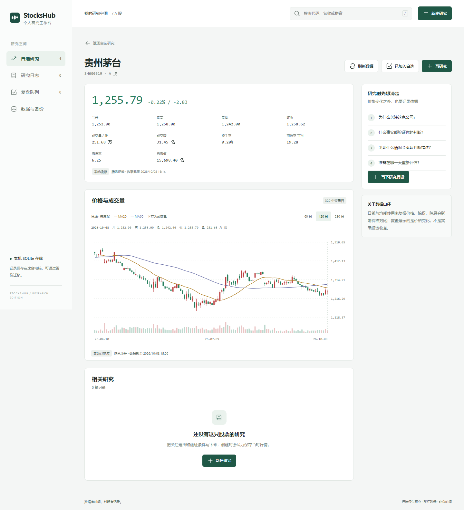

# StocksHub · 个人 A 股研究工作台

[打开 GitHub Pages](https://ibook000.github.io/stockshub-dashboard/)

把「看行情」变成「记录判断、验证判断」：搜索 A 股 → 自选 → 查看行情与日线 → 保存研究假设 → 到期复盘 → 导出自己的研究。



## 两种使用方式

| | GitHub Pages | 本机版 |
|---|---|---|
| 启动 | 打开网页 | Python 3.10+，一条命令 |
| 自选与研究 | 当前浏览器 IndexedDB | 本机 SQLite |
| 行情 | 腾讯公开接口 JSONP，失败回退缓存/公开快照 | Python 读取同一来源，失败回退 SQLite 缓存/公开快照 |
| 断网 | 首次打开缓存完成后，可重新打开、阅读及编辑研究 | 服务仍在运行时，可阅读及编辑研究 |
| 跨设备迁移 | 导出/导入 JSON | 同格式 JSON，可与 Pages 互通 |

Pages 不运行 Python。个人自选、日志、快照和复盘不会写入公开仓库，也不会自动云同步。浏览器清除网站数据、无痕会话结束或设备故障可能丢失记录，请定期导出备份。

## 本机启动

```bash
git clone https://github.com/Ibook000/stockshub-dashboard.git
cd stockshub-dashboard
python proxy_server.py
```

打开 [http://127.0.0.1:8765](http://127.0.0.1:8765)。不必先同步股票，不需要 Node、pip 包、付费密钥或外部图表 CDN。路径相对于项目解析，支持 Windows、macOS、Linux。

```bash
python proxy_server.py --port 9000 --database /path/to/research.db
```

默认数据库为 `local/stockshub.db`，也可设置 `STOCKSHUB_DB`。默认只监听本机回环地址；没有为公网提供账号或多人权限功能。旧 `/opt/stock-dashboard/stocks.db` 是行情缓存，不包含研究日志，不会自动覆盖或迁移为新数据库。

## 能完成的研究流程

- **A 股搜索与自选**：按名称、拼音、代码搜索；证券 ID 包含市场，例如 `sz000001` 是平安银行，`sh000001` 指数不属于股票搜索结果。沪、深、北市场均经过股票类型和代码格式过滤。
- **行情与历史**：数据来源、源时间、缓存状态独立展示；日线可查看 60/120/250 日，MA20/MA60 在本地计算，支持键盘左右查看价格。
- **可解释筛选**：只扫描自选股，按涨跌幅阈值或日线收盘高于 MA20/MA60；缺失、过期或备用缓存数据明确列出，不作为命中。均线筛选使用同一份日线的收盘价。
- **研究日志**：记录理由、验证条件、风险与自选复盘日期；创建时固定当时可取得的行情，读取失败仍可保存日志，价格基准留空。
- **历史版本与复盘**：编辑保留先前版本，原始行情基准不变；复盘结论追加保存，支持支持/证伪/继续观察，归档可以恢复。
- **后续价格对照**：只使用研究创建之后的数据。没有后续观察或原始基准时，明确显示等待或无法计算，不用过去行情伪造复盘结果。
- **备份与恢复**：完整导出自选、日志、基准、编辑版本和复盘。导入先验证全部内容，合并新增记录；重复研究 ID 跳过，已有内容不覆盖。最大导入 5 MB。



## 数据口径与限制

公开数据由腾讯证券提供，不保证免费接口始终可用、覆盖每只股票或满足交易时效。日线最多约 320 个交易日，价格与均线均为**未复权**；除权、除息会影响价格对照。页面显示的价格变化不计分红、费用和成交，不代表交易收益。

源时间超过 72 个自然小时提示时效异常，节假日或停牌也可能触发。接口返回时间与工作台读取时间分别保存；备用缓存保留原始日期，不重新标成实时。公开起始快照只覆盖 12 只股票，在线模式会按需获取其他股票。离线搜索只覆盖自选与起始列表。

Pages 用限定三个腾讯域名的 JSONP 解决上游缺少 CORS 的限制。这些远端脚本与页面具有相同执行权限，应视为可信第三方依赖；如需研究数据与第三方脚本隔离，请使用本机版（浏览器只向本机 API 请求）。页面无广告、统计 SDK、登录或付费功能。

## GitHub Pages 发布

`.github/workflows/pages.yml` 在 `main` 更新时先运行 Python、JavaScript 和浏览器测试，再构建并发布 `site/`。定时任务在北京时间工作日约 09:23、12:23、16:23 更新公开起始快照；Actions 调度可能延迟，数据是否新鲜以页面显示的源时间为准。也可手动触发工作流。

仓库 Settings → Pages → Source 使用 **GitHub Actions**。只打包首页、静态资源、公开行情快照和离线缓存脚本；本机数据库、测试、日志和个人备份不进入发布目录。

```bash
# 使用已提交的公开快照构建
python scripts/build_site.py

# 重新读取公开起始行情后构建
python scripts/build_site.py --refresh

# 兼容入口，同样只构建公开快照，不扫描个人数据库
python sync_stocks.py --refresh

# 查看静态 Pages 模式
python -m http.server 8000 --directory site
```

打开 [http://localhost:8000](http://localhost:8000)。静态模式与本机模式的数据分开保存，通过 JSON 备份迁移。

## 开发与验证

运行时只需 Python 标准库；Node 与 Playwright 仅用于开发测试。

```bash
python -m unittest discover -s tests -p "test_*.py" -v
npm ci
npm test
npx playwright install chromium
python scripts/build_site.py
npx playwright test
```

浏览器测试使用独立临时 SQLite 和浏览器上下文，市场响应来自测试专用固定数据；不会修改真实个人数据库。测试覆盖两种存储模式的搜索、自选、研究、版本、复盘、归档、备份导入，以及 Pages 子路径、离线重载和 320–2560px 布局。真实免费接口及公开部署另做连通性检查，测试数据不会发布。

## 代码结构

```text
index.html                  语义页面外壳
assets/app.js               研究流程与路由
assets/api.js                HTTP / 浏览器模式适配
assets/storage.js            IndexedDB 原子事务
assets/market.js             限定来源的 JSONP、缓存与公开快照回退
assets/domain.js             校验、指标、筛选与复盘计算
assets/chart.js              本地图表，无外部图表依赖
stockshub/domain.py          后端校验与复盘规则
stockshub/store.py           SQLite 存储、原子导入与修改
stockshub/providers.py       可替换免费数据适配器
stockshub/service.py         研究业务、请求合并与缓存
stockshub/server.py          本机 HTTP API 与静态文件白名单
scripts/build_site.py       公开快照及 Pages 构建
tests/                      单元、HTTP 与浏览器工作流测试
```

本机 API 文档见 [skill/stockshub-api.md](skill/stockshub-api.md)。2.0 移除了依赖外站的情绪分数、黑盒策略、研报抓取和 AI 分析入口，将功能集中在可验证的个人研究流程。旧 API 路径和返回格式不再兼容。

MIT License，见 [LICENSE](LICENSE)。
